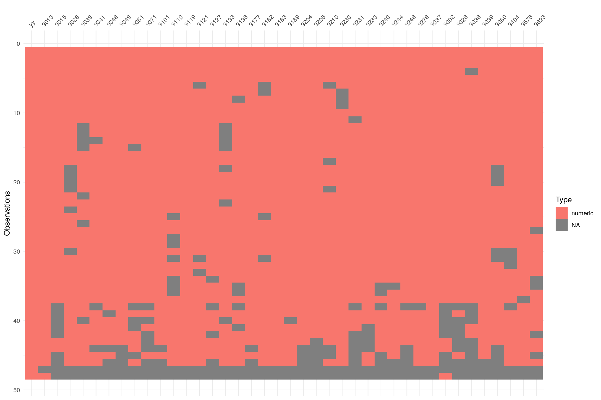

### Serie di precipitazione

Elenco delle stazioni con almeno 40 anni di dati annuali (tabella e grafico valgono sia per la temperatura minima che per la massima). 

Due domande:

- Se i criteri di completezza e continuità fossero meno restrittivi, si potrebbero ricavare da questa tabella altre stazioni per il Rapporto "Gli Indicatori del clima in Italia"?

- Queste serie vengono ancora continuate o sono serie relative a stazioni dismesse?

**Attenzione**: i valori cumulati annuali utilizzati per il grafico sotto sono stati calcolati utilizzando solo i mesi completi (nessun dato giornaliero NA) e gli anni con tutte le stagioni presenti (ammettendo al piu' tre mesi mancanti in un anno).  

|----| Codice |	Nome stazione |	lon |	lat |	quota |	codice HisCentral |
|----|------|----------------------|----------|----------|-----|-------------------|
| 1  | 9013 | ALFONSINE            | 12.04450 | 44.49303 | 7   | 08ALFONSINE       |
| 2  | 9015 | ANZOLAEMILIA         | 11.19651 | 44.55209 | 36  | 08ANZOLAEMILIA    |
| 3  | 9026 | BANDO                | 11.90478 | 44.63348 | 1   | 08BANDO           |
| 4  | 9039 | BENVIGNANTE          | 11.75596 | 44.66807 | 1   | 08BENVIGNANTE     |
| 5  | 9041 | BERRA                | 11.99771 | 44.97880 | 2   | 08BERRA           |
| 6  | 9048 | BOLOGNASLUCA         | 11.29834 | 44.47872 | 203 | 08BOLOGNASLUCA    |
| 7  | 9049 | BOLOGNAUFFID         | 11.34614 | 44.49990 | 45  | 08BOLOGNAUFFID    |
| 8  | 9051 | BOMBIANA             | 10.97365 | 44.21439 | 778 | 08BOMBIANA        |
| 9  | 9071 | CALDERARARENO        | 11.27214 | 44.56613 | 31  | 08CALDERARARENO   |
| 10 | 9101 | CASTELDELRIO         | 11.50489 | 44.21120 | 214 | 08CASTELDELRIO    |
| 11 | 9112 | CASTROCARO           | 11.94938 | 44.17014 | 70  | 08CASTROCARO      |
| 12 | 9119 | CERVIA               | 12.31891 | 44.27249 | 2   | 08CERVIA          |
| 13 | 9121 | CESENATICO           | 12.39741 | 44.20713 | 1   | 08CESENATICO      |
| 14 | 9127 | CODIGORO             | 12.09771 | 44.83513 | 2   | 08CODIGORO        |
| 15 | 9133 | CORNACERVINA         | 11.92131 | 44.77753 | 2   | 08CORNACERVINA    |
| 16 | 9138 | COTTEDE              | 11.16929 | 44.10963 | 838 | 08COTTEDE         |
| 17 | 9177 | GUAGNINO             | 12.21159 | 44.68842 | 3   | 08GUAGNINO        |
| 18 | 9182 | IDROVORAFOSSOGH      | 12.25264 | 44.35462 | 2   | 08IDROVORAFOSSOGH |
| 19 | 9183 | IMOLA                | 11.71264 | 44.34583 | 44  | 08IMOLA           |
| 20 | 9189 | JOLANDADISAVOIA      | 11.97660 | 44.88649 | 1   | 08JOLANDADISAVOIA |
| 21 | 9204 | LUGODIROMAGNA        | 11.91330 | 44.41773 | 12  | 08LUGODIROMAGNA   |
| 22 | 9206 | MALALBERGO           | 11.52905 | 44.71847 | 13  | 08MALALBERGO      |
| 23 | 9210 | MARINADIRAVENNA      | 12.28385 | 44.49094 | NA  | 08MARINADIRAVENNA |
| 24 | 9230 | MONTEACUTOALPI       | 10.88739 | 44.13639 | 828 | 08MONTEACUTOALPI  |
| 25 | 9231 | MONTEACUTOVALLE      | 11.20693 | 44.24192 | 573 | 08MONTEACUTOVALLE |
| 26 | 9233 | MONTECATONE          | 11.63630 | 44.34602 | 168 | 08MONTECATONE     |
| 27 | 9240 | MONTEOMBRARO         | 11.00490 | 44.37943 | 684 | 08MONTEOMBRARO    |
| 28 | 9244 | MONTESPIETRO         | 11.13634 | 44.43793 | 249 | 08MONTESPIETRO    |
| 29 | 9248 | MONZUNO              | 11.27351 | 44.27663 | 587 | 08MONZUNO         |
| 30 | 9276 | PAVANADIGA           | 11.00554 | 44.11828 | 467 | 08PAVANADIGA      |
| 31 | 9287 | PIANORO              | 11.33988 | 44.37103 | 196 | 08PIANORO         |
| 32 | 9302 | PORRETTATERME        | 10.97209 | 44.16649 | 383 | 08PORRETTATERME   |
| 33 | 9328 | RIOLOTERME           | 11.72415 | 44.27424 | 78  | 08RIOLOTERME      |
| 34 | 9338 | S_BENEDETTOQUER      | 11.48579 | 44.25307 | 331 | 08S_BENEDETTOQUER |
| 35 | 9339 | S_CLEMENTE           | 11.49063 | 44.31917 | 208 | 08S_CLEMENTE      |
| 36 | 9360 | SASSOMARCONI         | 11.24784 | 44.38152 | 130 | 08SASSOMARCONI    |
| 37 | 9404 | VERGATO              | 11.11311 | 44.28781 | 207 | 08VERGATO         |
| 38 | 9578 | Pennabilli-Marecchia | 12.26900 | 43.82020 | 580 | 08PENNABILLITELE  |
| 39 | 9623 | SNPANCRAZIO          | 12.08720 | 44.35960 | 9   | 08SNPANCRAZIO     |

