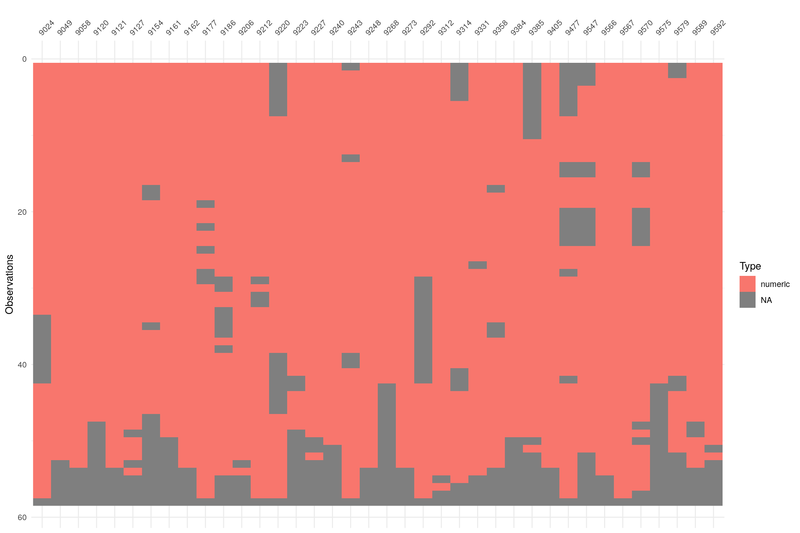

### Altre serie di temperatura

Elenco delle stazioni con almeno 40 anni di dati annuali (tabella e grafico valgono sia per la temperatura minima che per la massima). 

Due domande:

- Se i criteri di completezza e continuità fossero meno restrittivi, si potrebbero ricavare da questa tabella altre stazioni per il Rapporto "Gli Indicatori del clima in Italia"?

- Queste serie vengono ancora continuate o sono serie relative a stazioni dismesse?

**Attenzione**: i valori medi annuali utilizzati per il grafico sotto sono stati calcolati senza utilizzare la regola del 3/5 o del 5/10 quindi sono solamente indicativi della numerosità dei dati mancanti (in grigio) e dei dati disponibili (in arancione).

|----|Codice| Nome stazione| 	lon | lat |	quota |	codice HisCentral |
|----|------|------------------------------------------|----------|----------|------|-------------------|
| 1  | 9024 | BAISO                                    | 10.60569 | 44.49908 | 504  | 08BAISO           |
| 2  | 9049 | BOLOGNAUFFID                             | 11.34614 | 44.49990 | 45   | 08BOLOGNAUFFID    |
| 3  | 9058 | BOSCHIAVETO                              | 9.41993  | 44.58591 | 757  | 08BOSCHIAVETO     |
| 4  | 9120 | CESENA                                   | 12.21848 | 44.14397 | 34   | 08CESENA          |
| 5  | 9121 | CESENATICO                               | 12.39741 | 44.20713 | 1    | 08CESENATICO      |
| 6  | 9127 | CODIGORO                                 | 12.09771 | 44.83513 | 2    | 08CODIGORO        |
| 7  | 9154 | FERRARA                                  | 11.62098 | 44.83242 | 9    | 08FERRARA         |
| 8  | 9161 | FONTANALUCCIA                            | 10.51528 | 44.27889 | 766  | 08FONTANALUCCIA   |
| 9  | 9162 | FORLI                                    | 12.05551 | 44.21859 | 29   | 08FORLI           |
| 10 | 9177 | GUAGNINO                                 | 12.21159 | 44.68842 | 3    | 08GUAGNINO        |
| 11 | 9186 | ISOLAPALANZANO                           | 10.16215 | 44.42838 | 655  | 08ISOLAPALANZANO  |
| 12 | 9206 | MALALBERGO                               | 11.52905 | 44.71847 | 13   | 08MALALBERGO      |
| 13 | 9212 | MARRA                                    | 10.04744 | 44.47344 | 670  | 08MARRA           |
| 14 | 9220 | MIRANDOLAAGRO                            | 11.00854 | 44.88308 | 18   | 08MIRANDOLAAGRO   |
| 15 | 9223 | MODENAISA                                | 10.93430 | 44.64802 | 33   | 08MODENAISA       |
| 16 | 9227 | MOLATODIGA                               | 9.28802  | 44.90789 | 401  | 08MOLATODIGA      |
| 17 | 9240 | MONTEOMBRARO                             | 11.00490 | 44.37943 | 684  | 08MONTEOMBRARO    |
| 18 | 9243 | MONTESE                                  | 10.94203 | 44.27693 | 830  | 08MONTESE         |
| 19 | 9248 | MONZUNO                                  | 11.27351 | 44.27663 | 587  | 08MONZUNO         |
| 20 | 9268 | OZOLADIGA                                | 10.36861 | 44.28750 | 1518 | 08OZOLADIGA       |
| 21 | 9273 | PARMAUNIVERSITA                          | 10.31500 | 44.80457 | 55   | 08PARMAUNIVERSITA |
| 22 | 9292 | POLINAGO                                 | 10.72975 | 44.34366 | 741  | 08POLINAGO        |
| 23 | 9312 | QUARTODIGA                               | 12.08636 | 43.89069 | 387  | 08QUARTODIGA      |
| 24 | 9314 | RAMIOLA                                  | 10.09231 | 44.69726 | 137  | 08RAMIOLA         |
| 25 | 9331 | ROCCASCASCIANO2                          | 11.84195 | 44.05349 | 310  | 08ROCCASCASCIANO2 |
| 26 | 9358 | SARMATO                                  | 9.50273  | 45.08400 | 53   | 08SARMATO         |
| 27 | 9384 | STRETTARA                                | 10.70134 | 44.24905 | 972  | 08STRETTARA       |
| 28 | 9385 | STRINABECCO                              | 9.48956  | 44.45084 | 929  | 08STRINABECCO     |
| 29 | 9405 | VERGHERETO                               | 12.00440 | 43.79521 | 844  | 08VERGHERETO      |
| 30 | 9477 | PRACCHIA                                 | 10.90770 | 44.05680 | 660  | 08PRACCHIA        |
| 31 | 9547 | Acquerino Reno-Limonta                   | 11.01950 | 44.01170 | 859  | 08ACQUERINO       |
| 32 | 9566 | Imola meccanica Reno-Santerno            | 11.71480 | 44.34850 | 44   | 08IMOLAMEC        |
| 33 | 9567 | "Lago-Paduli"                            | 10.14050 | 44.34850 | 1181 | 08LAGOPADULI      |
| 34 | 9570 | "Maresca-Reno"                           | 10.85060 | 44.06030 | 1139 | 08MARESCA         |
| 35 | 9575 | Montecapraro                             | 9.15520  | 44.73610 | 853  | 08MONTECAPRARO    |
| 36 | 9579 | "POGGIORUSCO-ETG-Pianura Secchia-Panaro" | 11.12790 | 44.97040 | 14   | 08POGGIORUSCO     |
| 37 | 9589 | "San-Lazzaro-Alberoni-Trebbia"           | 9.72700  | 45.03780 | 53   | 08SNLAZZAROALB    |
| 38 | 9592 | "San-Michele-Centrale-Panaro-Scoltenna"  | 10.62830 | 44.19740 | 886  | 08SNMICHELECLE    |

