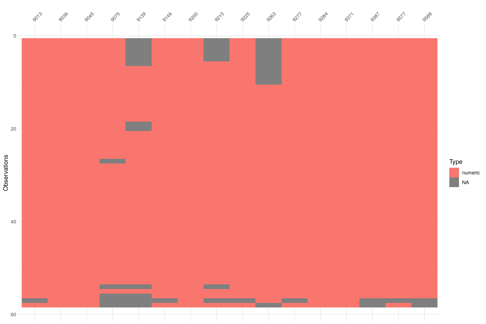

## Continuità delle serie annuali di temperatura

I grafici mostrano per il periodo 1961-2018 la continuità delle serie annuali di temperatura minima e massima, serie omogeneizzate utilizzate per il rapporto "Gli Indicatori del clima in Italia".

**Attenzione**: questi grafici sono solo indicativi, in quanto sono stati costruiti senza applicare la regola del 3/5 o del 5/10 del WMO, quindi i valori mancanti potrebbero essere più di quelli visualizzati (in grigio nei grafici).

### Temperatura massima

### Temperatura minima

