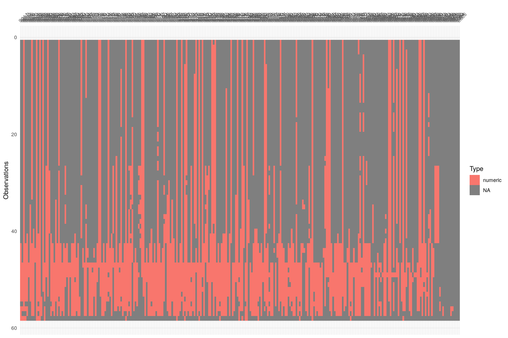

### Continuità delle serie annuali

I grafici mostrano per il periodo 1961-2018 la continuità delle serie annuali di temperatura e di precipitazione delle serie dell'Emilia-Romagna.
Per la temperatura il grafico riportato deve essere considerato valido sia per la temperatura minima che per la temperatura massima.

#### Serie temperatura

#### Serie precipitazione

